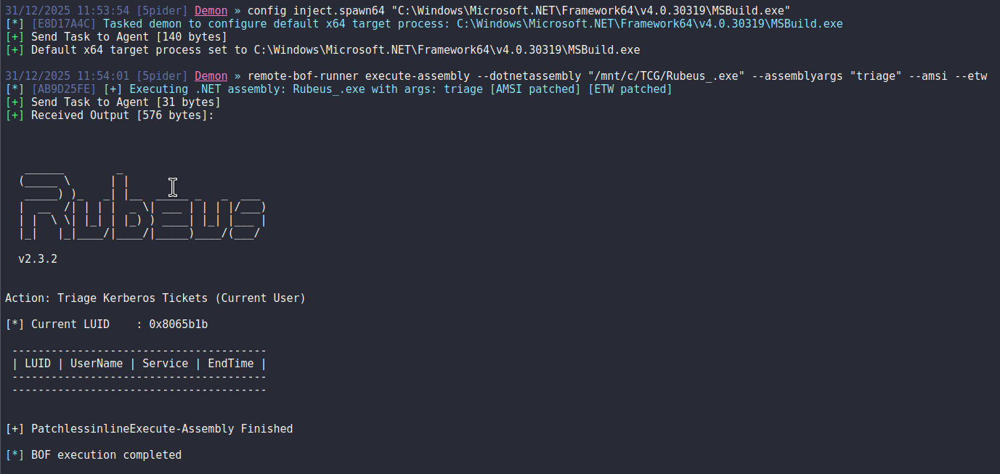

# Remote BOF Runner

A Havoc extension framework for remote execution of Beacon Object Files (BOFs) using a PIC loader made with Crystal Palace.

## Overview

Remote BOF Runner enables secure execution of BOFs in arbitrary processes by leveraging the Crystal Palace PIC loader. This framework implements a sophisticated inter-process communication (IPC) mechanism through named pipes to transparently forward beacon output from injected processes back to the command and control (C2) server.

## Setup & Installation

### Extension Installation
Ensure the extension is installed in the Havoc extensions directory:
```
YOUR_HAVOC_FOLDER + /data/extensions/
```

### Dependencies
To compile the PIC loader, the following tools and libraries must be installed on your system:

- **MinGW-w64**: Cross-compiler for Windows targets
- **Make**: Build automation tool
- **OpenJDK 11**: Java Development Kit (required for Crystal Palace compilation)
- **Zip**: Compression utility

For detailed setup instructions, refer to the [WSL Setup Guide](https://tradecraftgarden.org/wslsetup.html).

#### Installation Commands
```bash
sudo apt-get update
sudo apt-get install mingw-w64
sudo apt-get install make
sudo apt-get install openjdk-11-jdk
sudo apt-get install zip
```

## Architecture

### Components

#### 1. BOF Injector
The BOF component is responsible for:
- Creating and suspending a dummy process.
- Injecting the Crystal Palace loader + the target BOF into the dummy process.
- Establishing an IPC channel (named pipe) for output communication.
- Receiving and aggregating output from the remote BOF execution.

#### 2. PIC Loader (Crystal Palace)
The PIC loader consists of:
- **Crystal Palace Loader**: Handles memory allocation, BSS section management, and safe execution context initialization.
- **Remote BOF Payload**: The actual BOF code to execute (whoami, ipconfig, cacls, reg-query, etc.).
- **Argument Marshalling**: Serialized arguments passed through the loader for remote BOF execution.

### Execution Flow

```
┌───────────────────────────────────────────────────────────────────┐
│ 1. Beacon Process (Havoc)                                         │
│    ├─ Execute BOF Injector                                        │
│    ├─ Create dummy process (suspended)                            │
│    ├─ Inject PIC Loader + Remote BOF                              │
│    └─ Create IPC named pipe                                       │
└────────────┬──────────────────────────────────────────────────────┘
             │
             ▼
┌───────────────────────────────────────────────────────────────────┐
│ 2. PIC Loader Execution                                           │
│    ├─ Crystal Palace loader                                       │
│    ├─ Performs BSS section allocation                             │
│    ├─ Initializes UI context (for .NET compatibility)             │
│    └─ Hooks beacon functions (BeaconPrintf, BeaconOutput, etc.)   │
└────────────┬──────────────────────────────────────────────────────┘
             │
             ▼
┌───────────────────────────────────────────────────────────────────┐
│ 3. Remote BOF Execution                                           │
│    ├─ Execute target BOF (whoami, ipconfig, etc.)                 │
│    ├─ BOF calls hooked beacon functions                           │
│    ├─ Hooked functions redirect output to IPC pipe                │
│    └─ Output accumulates in beacon process via pipe               │
└────────────┬──────────────────────────────────────────────────────┘
             │
             ▼
┌───────────────────────────────────────────────────────────────────┐
│ 4. Output Collection & Transmission                               │
│    ├─ Beacon waits for remote process termination                 │
│    ├─ Accumulates all output from IPC pipe                        │
│    ├─ Aggregates fragmented messages (8KB buffer)                 │
│    ├─ Filters protocol delimiters (@START@, @END@)                │
│    └─ Transmits consolidated output to Team Server                │
└───────────────────────────────────────────────────────────────────┘
```

## Key Features

### 1. Process Isolation
- BOF execution occurs in a separate, isolated process.
- Minimizes impact on beacon process stability.
- Enables execution in arbitrary process contexts.

### 2. IPC Output Forwarding
- Named pipe-based communication channel.
- Transparent output redirection from remote BOF.
- Message fragmentation handling (8KB accumulation buffer).
- Protocol delimiter filtering.

### 3. .NET Process Execution
The primary use case is executing BOFs in native .NET processes:

**Why Direct CLR Loading in Beacon is Risky:**
Loading .NET assemblies directly in the beacon process is inherently unsafe and detectable:
- The beacon process (usually a native binary like cmd.exe or rundll32.exe) does not normally spawn a CLR.
- When a CLR is loaded into a non .NET process, should triggers immediate EDR/XDR alerts.

**A Possible Solution: Native .NET Process Injection:**
Instead of loading CLR into the beacon, we inject and execute our inline-execute-assembly BOF into a process that is already .NET-native:

```
// ❌ DETECTABLE: Direct execution in beacon
beacon.exe (native) → load ClrCreateInstance → load .NET assembly → EDR ALERT

// ✅ STEALTHY: Execution in native .NET process
dotnet.exe (native .NET) → inject BOF → inline-execute-assembly → 
execute .NET assembly in already-CLR context → normal behavior
```

This approach leverages the fact that executing .NET within a .NET process is indistinguishable from normal application behavior.

### 4. Crystal Palace Integration
- Position-independent code execution.
- Dynamic API resolution via hash-based function lookups.
- No import address table dependencies.
- Suitable for deep injection scenarios.

## Execution Modes

### Local Execution
```
remote-bof-runner whoami
remote-bof-runner ipconfig
remote-bof-runner cacls C:\Windows\System32
```

### Remote Host Execution
```
remote-bof-runner reg-query DC01 HKLM SYSTEM\CurrentControlSet
```

### Registry Queries
```
remote-bof-runner reg-query HKLM SYSTEM\CurrentControlSet\Control\Lsa
remote-bof-runner reg-query HKLM SYSTEM\CurrentControlSet\Control\Lsa RunAsPPL
```

### .NET Assembly Execution
```
remote-bof-runner execute-assembly --dotnetassembly "/Payloads/Rubeus.exe" --assemblyargs "triage"
```

**Example Output:**



## Available BOFs

- **whoami** - Display current user and group information (CS-Situational-Awareness-BOF).
- **ipconfig** - Show network adapter configuration (CS-Situational-Awareness-BOF).
- **cacls** - List file permissions (CS-Situational-Awareness-BOF).
- **reg-query** - Query Windows Registry (CS-Situational-Awareness-BOF).
- **execute-assembly** - Loads a .NET assembly into the actual process (https://github.com/VoldeSec/PatchlessInlineExecute-Assembly).
- **bof** - Execute custom BOF binaries.

## Operational Security Considerations

⚠️ **Important**: This project is a **Proof-of-Concept** and does **NOT** prioritize OPSEC by default.

### Recommended Modifications

Both the BOF Injector and PIC Loader require significant hardening for adversary simulations:

#### BOF Injector Hardening
- Implement custom process creation methods (not CreateProcessW).
- Use alternative injection techniques beyond standard WriteProcessMemory.
- Obfuscate IPC pipe naming (randomize identifiers).

#### PIC Loader Hardening
- Encrypt communication protocol (pipe messages).
- Implement YARA rule evasion for known signatures.
- Add a method to evade process hooks (indirect syscalls, unhooking methods, etc.).
- Add an encryption method to store the target BOF + Args.

## References

- [Crystal Palace](https://tradecraftgarden.org/)
- [LibIPC](https://github.com/pard0p/LibIPC) - Crystal Palace shared library for inter-process communication, based on Named Pipes.
- [PatchlessInlineExecute-Assembly](https://github.com/VoldeSec/PatchlessInlineExecute-Assembly) - BOF InlineExecute-Assembly to load .NET assembly in process but with patchless AMSI and ETW bypass using hardware breakpoint.
- [CS-Situational-Awareness-BOF](https://github.com/trustedsec/CS-Situational-Awareness-BOF) - Situational Awareness commands implemented using Beacon Object Files.

## Disclaimer

This tool is provided for educational and authorized security testing purposes only. Unauthorized access to computer systems is illegal. Users are responsible for ensuring compliance with all applicable laws and regulations.